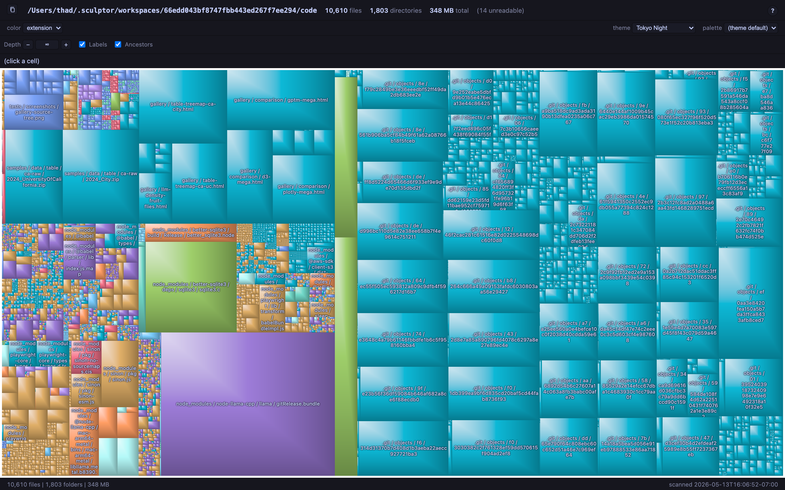

# gp-treemap: Beautiful, interactive, large-scale treemaps for the web

Treemaps are often the best way to quickly hone in on the "mass" in large,
hierarchical datasets.  You can think of them as "hierarchical pie charts".

For example, they're great for interactive visualizions of disk usage.

With this package, you can run:

```sh
# Opens browswer with a treemap of disk usage under ~/Downloads.
npx -p @imbue-ai/gp-treemap gpdu ~/Downloads
```

And see this visualization (click for the interactive version):

[](https://imbue-ai.github.io/gp-treemap/gallery/)


But it's not just for disk usage. gp-treemap is a general web component,
great for any time you have hierarchical counts to wrap your head around!

* Spending reports (they never looked so beautiful!)
* Budgets
* Profiling data
* Resource usage (Disk, RAM, inference tokens, electricity, ...)

Don't forget that lots of tabular data can be made hierarchical using GROUP BY on a list of columns.

Check out the [gallery of more examples](https://imbue-ai.github.io/gp-treemap/gallery/).

## Sandboxed usage

If you'd like the scanner to only be able to read the tree you're
scanning — no `~/.ssh`, no `/etc`, nothing else — run it under Deno's
per-path permission sandbox:

```sh
SCAN=~/Downloads
OUT=/tmp/disk_usage.html

deno run \
  --allow-read="$SCAN","$OUT" \
  --allow-write="$OUT" \
  --deny-env \
  npm:@imbue-ai/gp-treemap@0.3.4/gpdu --no-open "$SCAN" "$OUT" \
  && open "$OUT"
```


## A hat tip to GrandPerspective

Most treemap implementations we've seen are boring and don't scale well
to millions of nodes, with [GrandPerspective](https://grandperspectiv.sourceforge.net/)
being a wonderful exception.

`<gp-treemap>` is a standards-compliant Custom Element that renders interactive
treemaps with GrandPerspective's signature "raised tile" pixel shading — bright
upper-left, dark lower-right, with a crisp diagonal seam between the two halves
of every cell.

This project is a JavaScript/Canvas port of the treemap view from
[GrandPerspective](https://grandperspectiv.sourceforge.net/), the macOS disk
visualizer by Erwin Bonsma (and contributors). GrandPerspective is released
under the GNU General Public License, version 2, and so is `gp-treemap`.

The upstream 3.6.4 source is bundled under `GrandPerspective-3_6_4/` for
reference. The treemap layout, the raised-tile shader, and the HSV brightness
ramp were all translated from that source — this is a derivative work in the
GPL sense, not a clean-room reimplementation. If you want the original tool,
or want to see where these algorithms came from, go support that project.

If you use `gp-treemap`, please keep the attribution to Erwin Bonsma visible.

## Quick start

No install required — run directly via `npx`:

```sh
npx -p @imbue-ai/gp-treemap gpdu ~/Downloads
```

Scans `~/Downloads`, writes a self-contained HTML file, and opens it in your
default browser. Pass a second argument to choose the output path:

```sh
npx -p @imbue-ai/gp-treemap gpdu ~/Pictures /tmp/pictures.html
```

To install globally instead:

```sh
npm install -g @imbue-ai/gp-treemap
gpdu ~/Downloads
```

For a sandboxed run under Deno — scanner restricted to just the scan tree
and output directory — see the `deno run` example at the top of this README.

## Viewing the samples

```sh
node tools/build.js     # (re)generate dist/gp-treemap.bundle.js
open samples/index.html # or just double-click it in Finder
```

Each sample is a plain HTML file loading the bundle with a sibling
`<script src="../dist/gp-treemap.bundle.js">` tag — no ES modules, no CORS,
no server required. `file://` works.

If you prefer to serve over HTTP:

```sh
npm run serve
# → http://localhost:4173/samples/index.html
```

## CLI tools

A few bin scripts ship with the package; each file's header comment documents
its flags and output format in detail.

- **`gpdu <dir> [output.html]`** — [`tools/gpdu-scan.js`](tools/gpdu-scan.js). Recursive
  directory scan; writes a single self-contained HTML file with the bundle and
  dataset inlined. Symlinks are not followed.
- **`gp-treemap-profile-load <input.html> [out.cpuprofile]`** —
  [`tools/profile-load.js`](tools/profile-load.js). Launches headless Chromium,
  records a V8 CPU profile across page load, and writes a standard Chrome
  DevTools `.cpuprofile`. Requires Playwright + Chromium
  (`npx playwright install chromium`).
- **`gp-treemap-profile-to-html <input.cpuprofile> [out.html]`** —
  [`tools/profile-to-html.js`](tools/profile-to-html.js). Renders a
  `.cpuprofile` as a self-contained treemap of CPU time, bucketed by thread and
  call stack.

### Other gpdu-* tools (in development — invoke via `node tools/gpdu-*.js`)

- **`gpdu-json <input.json5> [output.html]`** —
  [`tools/gpdu-json.js`](tools/gpdu-json.js). Visualizes a JSON or JSON5 file
  as a treemap. Each cell's area is the byte size of that node's serialized
  form in the source file. Internal nodes (objects, arrays) carry a synthetic
  `(leftover)` leaf that absorbs structural-overhead bytes (braces, brackets,
  commas, whitespace, comments), so the tree's total reconciles to the source
  file size exactly. Color modes: type / depth / key. Pruning: `--min-bytes=N`,
  `--max-array-children=N`. Accepts JSON5 (comments, trailing commas, unquoted
  keys, single-quoted strings).
- **`gpdu-sqlite <db.sqlite> [output.html]`** —
  [`tools/gpdu-sqlite.js`](tools/gpdu-sqlite.js). Visualizes a SQLite file as
  a treemap. Hierarchy: db → table → [column-1, ..., index-1, ...]. Per-column
  byte sizes are estimated by sampling rows (default 10 000, override with
  `--sample-rows=N`) and applying SQLite's serial-type encoding rules JS-side.
  Pass `--include-row-elements-for-all-columns` for an exact count via a full
  table scan, with each (row, column) becoming a leaf. System tables, views,
  and triggers are shown alongside (views & triggers as 0-byte cells). Color
  modes: kind / parent-table / value-type. Requires `better-sqlite3` (an
  `optionalDependency`).

## Repo layout

```
src/                    component source (ES modules)
  gp-treemap.js           custom element: canvas render + hit-testing + toolbar
  painter.js              per-pixel raised-tile painter
  lut.js                  brightness-ramp LUT
  layout.js               BSP slice-and-dice
  balancer.js             balanced-binary-tree merge
  builder.js              tabular + tree accessor ingestion
  color-resolver.js       palette index assignment
  color-scale.js          linear / log / diverging / quantile
  palettes.js             built-in palettes
  hash.js                 FNV-1a for categorical color hashing
  format.js               d3-format-ish value formatter

samples/                one HTML per behavior (load via <script src>)
  index.html              links to all samples
  filesystem.html         categorical, bytes formatter
  budget.html             diverging quantitative
  depth.html              ~960 leaves, categorical by order
  interactions.html       event log + zoom demo
  gradients.html          intensity 0 / 0.5 / 1 side by side
  min-cell.html           pruning comparison
  located.html            highlight-node demo
  data/                   small datasets the samples attach to window.__data

dist/                   build output
  gp-treemap.bundle.js        single-file IIFE; defines the custom element

tests/                  Playwright suite (Chromium)
  visual.spec.js          screenshots → tests/screenshots/*.png
  units.spec.js           core module unit tests (browser-run)
  file-url.spec.js        smoke test that file:// renders correctly
  unit-fixture.html       loader that exposes bundle helpers on window
  screenshots/            committed PNGs — browse offline

tools/
  build.js                concatenates src/ → dist/gp-treemap.bundle.js
  server.js               tiny static server (used by Playwright & local dev)
  gpdu-scan.js            recursive directory scan → self-contained treemap HTML
  profile-load.js         Playwright+CDP CPU profile capture → .cpuprofile
  profile-to-html.js      .cpuprofile → treemap HTML (thread / call-stack)

GrandPerspective-3_6_4/ upstream source bundled for reference (GPL v2)
```

## Tests

```sh
npm run test:install     # one-time: download Chromium
npm test                 # run units + visual snapshots
```

## Spec deltas from upstream GrandPerspective

- **Web Component, not a Cocoa view.** Rendering is a per-pixel loop on a
  single `<canvas>`. Paint of a full 1280×720 canvas with a few thousand cells
  takes ~10–30 ms; WASM could give 5–20× headroom for 100k+ cells or per-frame
  animation, not needed for MVP.
- **Plain ES modules + IIFE bundle** — no Stencil, no generated React/Vue
  wrappers. A Stencil wrapper can be grafted on later without API churn.
- **FLIP data-change animations** are not yet implemented; a data change
  rerenders the whole canvas.
- **Resize** immediately CSS-scales the canvas, then re-paints after a
  150 ms debounce.
- Toolbar, palettes, color scales, keyboard / wheel / double-click behavior,
  and FNV-1a categorical hashing are all new to this port.

## License

GNU General Public License, version 2. See [`LICENSE`](LICENSE).
